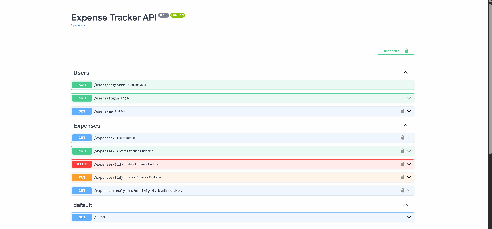

# 💸 Expense Tracker API

API backend desarrollada con **FastAPI** para la gestión de gastos personales, con autenticación JWT, arquitectura limpia y tests automatizados.

---

## 🎥 Demo



---

## 🚀 Demo rápida

1. Regístrate  
2. Haz login  
3. Crea gastos  
4. Consulta analytics mensual  

👉 Documentación interactiva (Swagger):  
http://127.0.0.1:8000/docs

---

## 🎯 Objetivo

Construir una API realista que demuestre:

- Autenticación segura con JWT  
- Gestión de datos por usuario  
- Arquitectura limpia (routes / services / models)  
- Testing automatizado  

---

## 🛠️ Stack

- FastAPI  
- SQLAlchemy  
- SQLite  
- JWT (python-jose)  
- Passlib (hash de contraseñas)  
- Pytest  

---

## 📁 Estructura

```
app/
 ├── api/
 ├── core/
 ├── db/
 ├── models/
 ├── schemas/
 ├── services/
tests/
```

---

## ⚙️ Instalación

```bash
git clone https://github.com/Marcial-Godes/expense-tracker-api.git
cd expense-tracker-api

python -m venv .venv
.venv\Scripts\activate

pip install -r requirements.txt

uvicorn app.main:app --reload
```

---

## 🔐 Configuración

El proyecto incluye un archivo `.env.example` con valores por defecto:

```
DATABASE_URL=sqlite:///./test.db
SECRET_KEY=your_secret_key_here
```

👉 No es obligatorio crear `.env`, la aplicación funciona con valores por defecto.

---

## 🧪 Tests

```bash
pytest -v
```

✔ Todos los tests deben pasar

---

## 📌 Endpoints principales

### Auth
- `POST /users/register`
- `POST /users/login`

### Expenses
- `POST /expenses/`
- `GET /expenses/`
- `PUT /expenses/{id}`
- `DELETE /expenses/{id}`

### Analytics
- `GET /expenses/analytics/monthly`

---

## 🧠 Decisiones técnicas

- Uso de **Decimal** para evitar errores de precisión  
- Separación en capas (API / Service / DB)  
- Validación con Pydantic  
- Control de acceso por usuario  

---

## 📈 Estado

✔ Proyecto funcional  
✔ Tests pasando  
✔ Setup reproducible  
✔ Sin necesidad de configuración adicional  

---

## 👨‍💻 Autor

Marcial Godes
